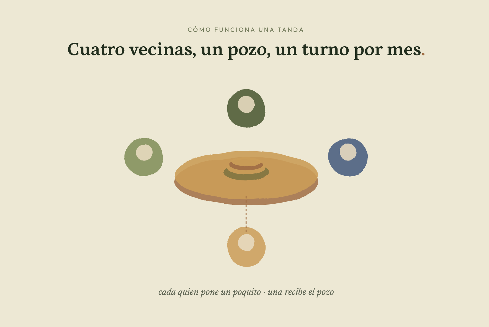
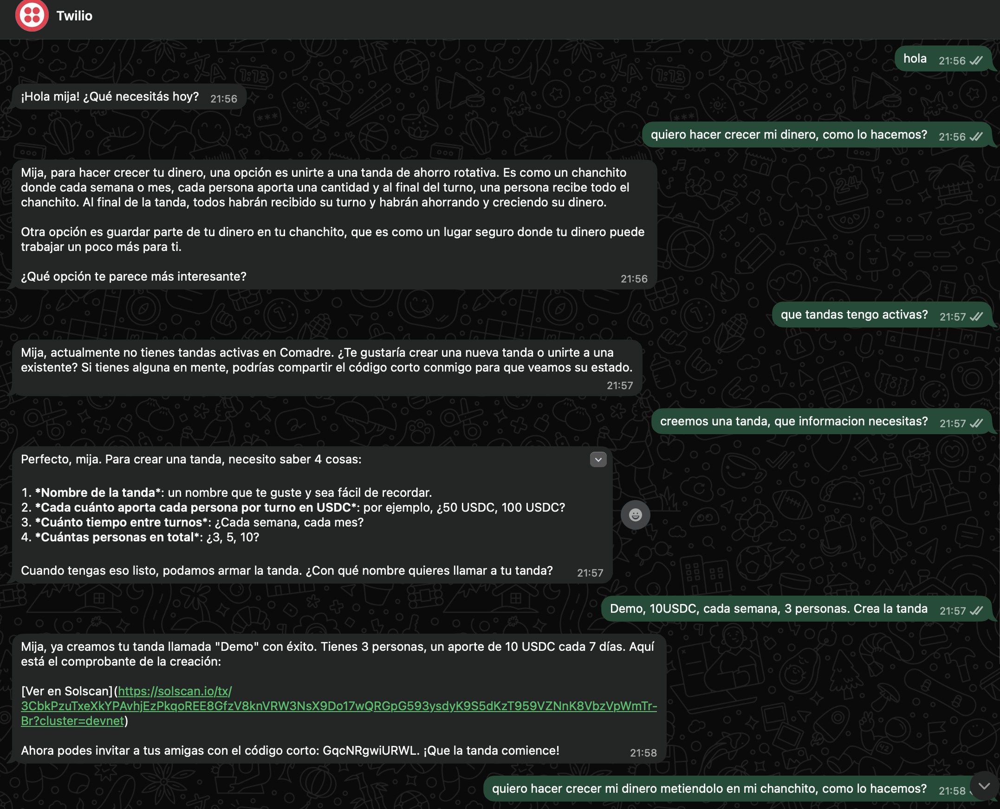
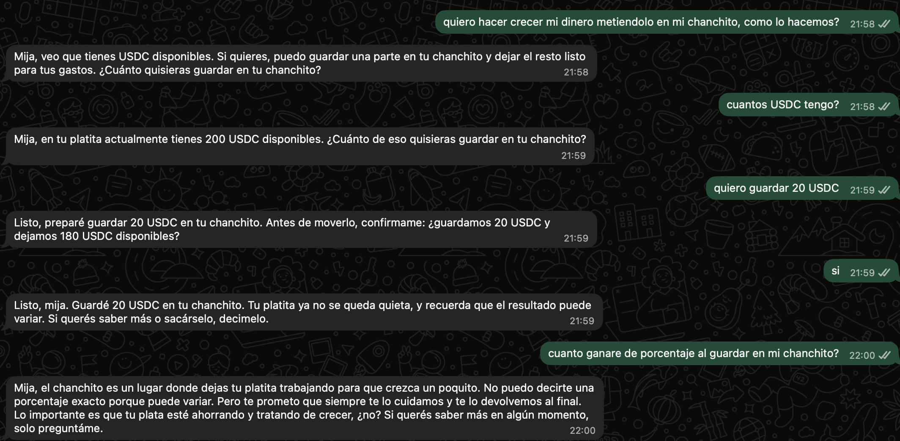
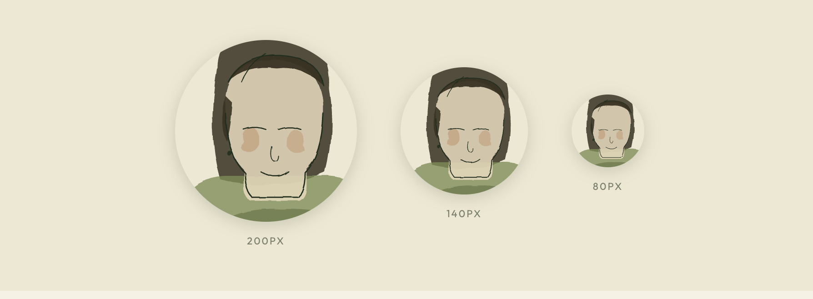
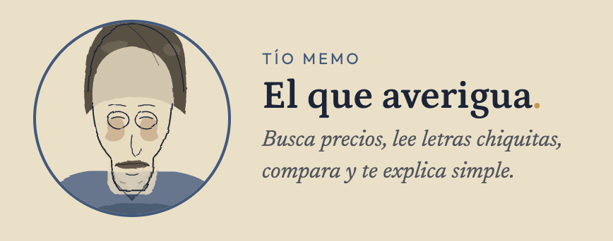
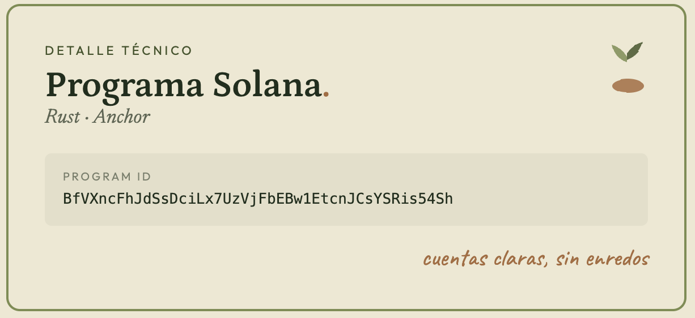

# 🌿 Comadre.

<p align="center">
  
</p>

> **Tu vecina de confianza, en tu teléfono.**  
> Para mandar dinero, guardar tu platita, organizar tandas y comprar lo que necesitás — sin que tengas que entender cripto, wallets ni palabras raras.

Mi abuela no sabe qué es una blockchain. No sabe qué es una wallet. No sabe qué es USDC.  
Pero sí sabe algo muy duro: cada mes cobra su renta, guarda lo que puede “para después”, y la inflación le va comiendo ese esfuerzo despacito, sin pedir permiso.

Esa plata que duerme bajo el colchón no está quieta: **está perdiendo vida**.

Por eso Comadre no le habla a la abuela con palabras raras ni pantallas difíciles. Le habla de algo que sí entiende:

> “Mija, podemos dejar tu dinerito en el colchón… o ponerlo en el chanchito.”

Pero este no es el chanchito quieto de cerámica. **Es un chanchito que corre, trabaja y cuida tu platita por vos.**<br>
Chau inflación. Hola, Comadre.

**Comadre** nace para cambiar eso. No como un banco frío. No como una app llena de gráficos. Sino como esa tía o abuela latinoamericana que te habla suave, te cuida, te pregunta dos veces antes de mover tu dinero y te dice:

> “Tranquila, mija. Yo te ayudo. Tu dinero va a estar en buenas manos.”

---

## Qué podés hacer con Comadre

Comadre vive donde la gente ya está: **WhatsApp**. Y también se integra con **Solana Mobile**, para que la tecnología esté cerca, pero nunca estorbe.

| Podés pedirle | Cómo se siente | Qué resuelve |
|---|---|---|
| **Mandar dinero** | “Comadre, mandale $50 a mi hija.” | Transferencias por número de teléfono y WhatsApp, sin copiar direcciones largas. |
| **Recibir o cobrar** | “Recuérdale a Juan que me debe.” | Pedir, recibir y ordenar cobros con una conversación natural. |
| **Guardar en el Chanchito** | “Comadre, guardame un poquito.” | Guardadito USDC: Comadre te aconseja cuánto dejar disponible y cuánto poner a trabajar, sin explicar la cocina técnica. |
| **Crear tandas** | “Hagamos una tanda con mis primas.” | Grupos de ahorro rotativo: todos aportan, y en cada turno una persona recibe el pozo. |
| **Comprar o buscar mejores precios** | “¿Dónde está más barata esta medicina?” | Tío Memo ayuda a buscar, comparar y volver con una respuesta clara. |

<p align="center">
  
</p>

La promesa es simple: **Comadre hace que la plata de la familia se mueva, se cuide y trabaje mejor.**

---

## Demo real por WhatsApp

Para el hackathon estamos usando **Twilio Sandbox for WhatsApp** como puente rápido y confiable. Por eso, en las capturas todavía aparece “Twilio” arriba: no es la marca final, es el carril técnico que nos dejó probar Comadre desde WhatsApp real sin esperar aprobaciones comerciales.

La experiencia que queremos conservar es esta: una conversación sencilla, con confirmaciones claras, donde Comadre crea tandas y prepara Guardadito sin obligar al usuario a entender infraestructura.

<p align="center">
  
</p>

<p align="center">
  
</p>

**Roadmap de marca:** pasar de Twilio Sandbox a un **WhatsApp Business oficial de Comadre**, con nombre, foto de Tía Vera, número propio y plantillas aprobadas para recordatorios, tandas y Guardadito.

---

## Guardadito: el chanchito que trabaja por vos

La pregunta de Comadre es sencilla:

> “¿Querés dejar tu dinerito en el colchón, o preferís que el chanchito lo cuide y lo ponga a trabajar?”

El **Guardadito** es ese chanchito. No se presenta como una inversión complicada ni como una pantalla llena de porcentajes. Comadre mira tu dinero disponible, te aconseja con calma y siempre deja algo para tus gastos.

Ejemplo:

| Si recibís | Comadre puede sugerir |
|---:|---|
| `50 USDC` | “Guardamos 30 en el chanchito y dejamos 20 listos para tus gastos.” |

Nada se mueve sin permiso. Primero Comadre explica, después pregunta, y recién si respondés “sí” prepara el Guardadito.

> “Puede ayudar a que tu platita no se quede quieta, mija. No es magia ni promesa fija: puede variar, por eso te confirmo antes.”

---

## Por qué importa

En LATAM mucha gente no pierde dinero porque sea irresponsable. Lo pierde porque el sistema le habla en otro idioma.

Le dicen “rendimiento”, “custodia”, “DeFi”, “staking”, “wallet”, “liquidez”, “on-chain”.  
Y la persona que solo quiere cuidar su renta termina haciendo lo único que conoce: guardar efectivo, esperar, y rezar para que alcance.

Comadre traduce esa complejidad a una relación humana:

- “Te guardé esto.”
- “Esto te puede rendir un poquito más.”
- “Antes de mandarlo, confirmemos el número.”
- “Tu tanda ya está armada.”
- “Mira, encontré una opción más barata.”

**CONCEPTOS > CÓDIGO.** Primero entendemos el problema humano. Después usamos Solana para resolverlo de verdad.

---

## La familia Comadre

### Tía Vera

Tía Vera es la cara principal de Comadre: paciente, clara, dulce y práctica. Ella acompaña el dinero del día a día: mandar, recibir, ahorrar, cobrar y organizar tandas.

<p align="center">
  
</p>

> “A ver, mija — confirmo el monto y el número antes de mandarlo.”

### Tío Memo

Tío Memo aparece cuando hay que buscar algo: precios, productos, compras, información o mejores opciones. No reemplaza a Comadre; la ayuda por detrás, como ese tío que siempre averigua antes de recomendar.

<p align="center">
  
</p>

> “Déjame que Memo lo revise con calma y te digo cuál conviene.”

---

## Modelo de negocio

Todavía estamos afinando los números, pero la dirección es clara: Comadre tiene que ser útil, sostenible y justa.

| Línea | Idea inicial |
|---|---|
| Guardadito / Chanchito | Cuando una persona acepta guardar dinero, Comadre puede poner una parte a trabajar en estrategias seleccionadas. La comisión futura sería pequeña y ligada al valor generado, nunca a confundir al usuario. |
| Tandas | Comisión baja por crear, administrar y proteger la tanda: recordatorios, reglas claras y ejecución transparente. |
| Compras asistidas | Comisión por compras realizadas mediante integraciones como `pay.sh` cuando Comadre ayuda a encontrar, comparar y pagar. |
| Servicios financieros futuros | Pagos de facturas, comida, despensa, recargas y pagos cotidianos dentro de la misma conversación. |

La clave: **Comadre gana cuando ayuda a que el usuario esté mejor, no cuando lo confunde.**

---

## Por qué Solana

Elegimos Solana porque Comadre necesita infraestructura rápida, barata y real. No para presumir tecnología, sino para esconderla bien.

| Necesidad de Comadre | Por qué Solana ayuda |
|---|---|
| Mover dinero pequeño sin matar al usuario en fees | Transacciones rápidas y costos bajos. |
| Usar USDC como dinero estable | Liquidez y rails ya existentes en el ecosistema. |
| Integrarse con móvil | Solana Mobile nos permite acercar la experiencia a teléfonos reales. |
| Construir reglas transparentes | Un programa on-chain puede modelar tandas, aportes, turnos y disputas. |
| Conectar ahorro con productos financieros | El ecosistema permite integraciones con vaults y protocolos seleccionados. |

Solana está abajo. Comadre está arriba.  
La abuela no ve la infraestructura; solo ve que su dinero se cuida mejor.

---

## Roadmap

### 1. Confianza cercana

Empezar con personas y comunidades cercanas: familiares, vecinos, pequeños grupos de ahorro y usuarios que ya usan WhatsApp todos los días.

También queremos apoyarnos en contenido educativo y distribución social con creadores como `@israstreet`, hablando especialmente a gente que escucha de cripto pero todavía no sabe cómo usarlo sin miedo.

### 2. Tandas, ahorro y transferencias

Hacer que Comadre sea útil todos los días:

- mandar dinero por número;
- recibir y cobrar;
- crear tandas familiares;
- guardar dinero con permiso en el Chanchito;
- explicar cada paso con calma.

Durante el hackathon usamos Twilio para mover rápido. El siguiente paso de producto es abrir el **WhatsApp Business oficial de Comadre**, con identidad visual propia y mensajes aprobados para producción.

### 3. Vida diaria dentro de Comadre

Integrar pagos y compras con USDC:

- pagar facturas;
- comprar comida;
- pedir despensa;
- comprar por internet;
- comparar precios;
- recibir recordatorios;
- manejar el dinero familiar desde una conversación.

### 4. Expansión LATAM

Crecer país por país, respetando lenguaje, confianza y hábitos locales. Comadre no tiene que sonar como Silicon Valley: tiene que sonar como alguien que tu familia sí escucharía.

---

## Assets visuales del README

Ya no son referencias rotas: estos assets viven en [`docs/assets/branding`](docs/assets/branding) y siguen la paleta cálida de Comadre.

| Asset | Archivo | Dónde se usa |
|---|---|---|
| Hero banner | [`hero-banner.png`](docs/assets/branding/hero-banner.png) | Apertura del README: primera impresión de marca. |
| Tandas visual | [`tandas-visual.png`](docs/assets/branding/tandas-visual.png) | Sección “Qué podés hacer”: explica una tanda sin ponerse técnica. |
| Tía Vera avatar | [`avatar-tia-vera.png`](docs/assets/branding/avatar-tia-vera.png) | Sección “La familia Comadre”: cara principal del producto. |
| Tío Memo mini-card | [`tio-memo-minicard.png`](docs/assets/branding/tio-memo-minicard.png) | Búsqueda, compras y comparación de precios. |
| Programa Solana | [`programa-solana.png`](docs/assets/branding/programa-solana.png) | Sección técnica final para reviewers. |
| Demo WhatsApp — tandas | [`whatsapp-tandas-demo.png`](docs/assets/demo/whatsapp-tandas-demo.png) | Prueba real de conversación creando una tanda desde Twilio Sandbox. |
| Demo WhatsApp — Guardadito | [`whatsapp-guardadito-demo.png`](docs/assets/demo/whatsapp-guardadito-demo.png) | Prueba real de conversación guardando USDC en el chanchito. |

**Pendientes visuales:** chanchito Guardadito corriendo y, si queremos reemplazar las capturas de hackathon, un mockup propio de WhatsApp con avatar de Tía Vera y número oficial de Comadre.

---

## Colores del branding kit

### Tía Vera — paleta principal

| Color | Hex | Uso |
|---|---:|---|
| Hoja | `#1f2e1c` | Texto, trazos y contraste principal |
| Nopal | `#7c8c4f` | Color central de Comadre |
| Olivo | `#43542a` | Profundidad, sombra, confianza |
| Barro | `#a86b3c` | Punto del logo, acentos cálidos |
| Miel | `#d49a4a` | Optimismo, llamadas suaves |
| Papel | `#eee8d2` | Fondos, calma, lectura |

### Tío Memo — paleta secundaria

| Color | Hex | Uso |
|---|---:|---|
| Tinta | `#1a2538` | Texto y trazos de Memo |
| Añil | `#3d5a7f` | Búsqueda, criterio, calma |
| Mezclilla | `#1f3650` | Profundidad y contraste |
| Ocre | `#d4923a` | Acento cálido |
| Miel | `#c47a2a` | Detalles secundarios |
| Hueso | `#ecdfc5` | Fondo alternativo |

Más detalle en [`docs/BRANDING.md`](docs/BRANDING.md).

---

# Technical proof / Para reviewers

La parte técnica está acá abajo a propósito. Primero viene la persona; después la infraestructura.

## Hackathon checklist

| Requirement | Status |
|---|---|
| Project name + short description | **Comadre.** — a WhatsApp-first financial agent for LATAM communities. |
| Unique Solana program written in Rust | **Yes.** `comadre`, built with Rust + Anchor 0.31. |
| Deployed at least to devnet | **Yes.** Devnet program ID below. |
| Contract deployment addresses in README | **Yes.** See the big Program ID section. |
| Public GitHub repo | **Yes.** <https://github.com/Firrton/comadre> |
| README + setup instructions | **Yes.** See [How to run it](#how-to-run-it--cómo-correrlo). |

## Smart contract / App ID

<p align="center">
  
</p>

```txt
BfVXncFhJdSsDciLx7UzVjFbEBw1EtcnJCsYSRis54Sh
```

- **Network:** Solana devnet
- **Program:** `comadre`
- **Framework:** Rust + Anchor 0.31
- **Source:** [`packages/anchor-program`](packages/anchor-program)
- **Explorer:** <https://explorer.solana.com/address/BfVXncFhJdSsDciLx7UzVjFbEBw1EtcnJCsYSRis54Sh?cluster=devnet>
- **Mainnet:** not deployed yet

## Stack técnico

| Layer | Tech |
|---|---|
| Solana program | Rust + Anchor 0.31 |
| Backend runtime | Bun 1.2+ |
| API | Hono 4 |
| Agent | Kimi K2 via Moonshot |
| WhatsApp | Twilio Sandbox for hackathon; WhatsApp Business oficial en roadmap |
| Wallets/Auth | WhatsApp auth-by-channel + custodial demo keypairs |
| Guardadito | Mock strategy by default; Kamino adapter behind env |
| Database | Postgres / Supabase |
| Cache | Upstash Redis REST |
| RPC | Helius |
| Mobile target | Solana Mobile / Expo |

## How to run it / Cómo correrlo

### 1. Install

```bash
git clone https://github.com/Firrton/comadre.git
cd comadre
bun install
cp .env.example .env.local
```

Fill `.env.local` using [`docs/DEVELOPMENT.md`](docs/DEVELOPMENT.md).

### 2. Solana program

```bash
bun run anchor:build
bun run anchor:test
```

To deploy your own devnet instance:

```bash
bun run anchor:deploy:devnet
```

Current shared devnet deployment:

```txt
COMADRE_PROGRAM_ID=BfVXncFhJdSsDciLx7UzVjFbEBw1EtcnJCsYSRis54Sh
```

### 3. Backend services

```bash
bun run db:migrate
bun run dev
```

| Service | URL | Role |
|---|---|---|
| `apps/api` | <http://localhost:3001> | Public API, auth, tx building |
| `apps/whatsapp` | <http://localhost:3002> | Twilio webhook and replies |
| `apps/agent` | <http://localhost:3003> | Conversational tool loop |
| `apps/indexer` | <http://localhost:3004> | Helius webhook skeleton |
| `apps/cron` | <http://localhost:3005> | Scheduled jobs |

For deploy, `init_config`, IDL upload and devnet USDC setup, read [`docs/RUNBOOK.md`](docs/RUNBOOK.md).

## Current MVP status

| Area | Status |
|---|---|
| Public repo | ✅ `Firrton/comadre` |
| Anchor program | ✅ Deployed to devnet |
| WhatsApp agent services | ✅ Implemented via Twilio Sandbox for hackathon |
| P2P transfer path | ✅ Implemented with custodial signer + USDC devnet flow |
| Guardadito / Chanchito | ✅ Mock flow + agent tools + Twilio nudges; Kamino adapter boundary behind env |
| Tandas on-chain | ✅ Create/join backend path restored; full production hardening still pending |
| KYC / Sumsub | ⚠️ Stubbed / Phase 2 |
| Mainnet | ❌ Not deployed |

## Docs

| Need | Doc |
|---|---|
| Brand, voice, colors, characters | [`docs/BRANDING.md`](docs/BRANDING.md) |
| Architecture | [`docs/ARCHITECTURE.md`](docs/ARCHITECTURE.md) |
| Local setup | [`docs/DEVELOPMENT.md`](docs/DEVELOPMENT.md) |
| Deploy and operations | [`docs/RUNBOOK.md`](docs/RUNBOOK.md) |
| Backend overview | [`docs/BACKEND.md`](docs/BACKEND.md) |
| Data model | [`docs/DATA_MODEL.md`](docs/DATA_MODEL.md) |
| End-to-end flows | [`docs/FLOWS.md`](docs/FLOWS.md) |
| Packages | [`docs/PACKAGES.md`](docs/PACKAGES.md) |
| Glossary | [`docs/GLOSSARY.md`](docs/GLOSSARY.md) |
| MVP checklist | [`docs/CHECKLIST.md`](docs/CHECKLIST.md) |

## License

MIT

---

## Cómo funciona técnicamente

> **Tres oraciones núcleo:** El backend tiene cada wallet de usuario. La identidad es el número WhatsApp (verificado por la firma del webhook de Twilio). El usuario confirma cada movimiento por WhatsApp — sin app, sin seed, sin custodia de su lado.

### Modelo de firma — auth-by-channel (custodial)

Al registrarse, el backend genera un `Keypair` Solana server-side y guarda la `secret_key` (base58) en la tabla `user_keypairs`. Toda instrucción on-chain se firma con `signWithUserKeypair`. El usuario nunca ve ni toca una llave; su número WhatsApp es su identidad.

Esto reemplaza el approach inicial con embedded wallets de Privy. El signing server-side de Privy requería authorization keys que no pudimos provisionar en el plazo del hackathon, y agregaba complejidad innecesaria para un demo. El trade-off es explícito: **arquitectura custodial grado-hackathon** — producción requeriría encryption-at-rest (AES-GCM) y un KMS/HSM para las secret keys.

### Componentes on-chain

| Instrucción | Payer | Signer |
|---|---|---|
| `init_user_profile` | `fee_payer` (plataforma) | `fee_payer` |
| `update_kyc_tier` | `fee_payer` | `kyc_oracle` |
| `create_tanda` | `fee_payer` | `creator` (custodial) |
| `join_tanda` | `fee_payer` | `user` (custodial) |

### Servicios

Tres systemd-user services corren en un VPS:
- `comadre-api` — REST API + builder de transacciones Anchor
- `comadre-agent` — agent loop con LLM (tool-based, wallet-state-aware)
- `comadre-whatsapp` — recibe webhooks de Twilio y enruta sesiones

Postgres corre nativo en el VPS. Redis es Upstash REST (cloud).
