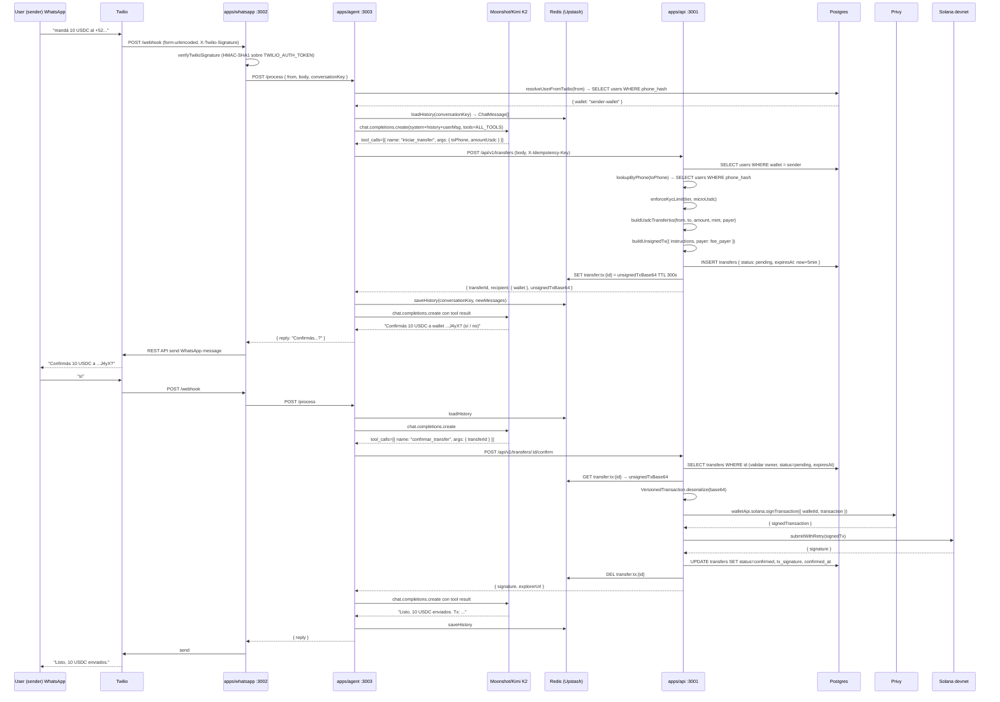
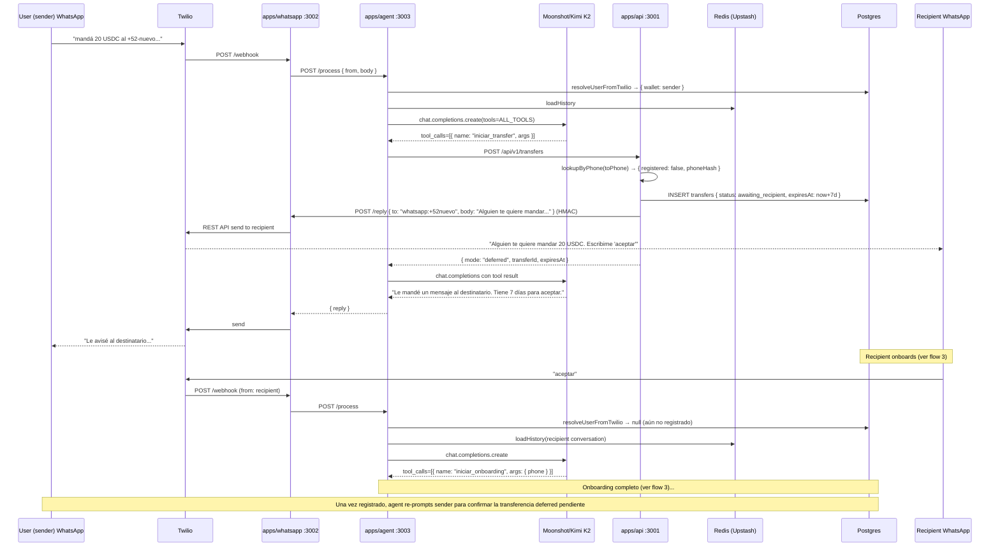
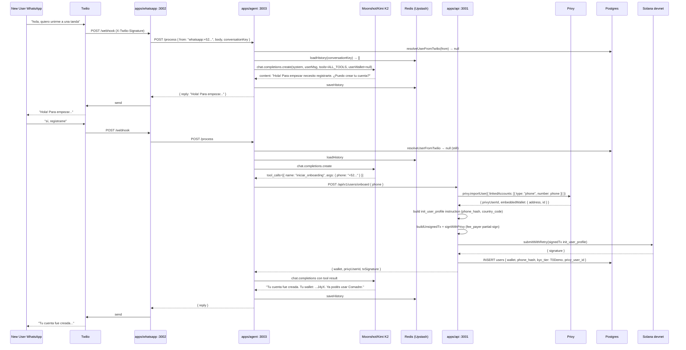
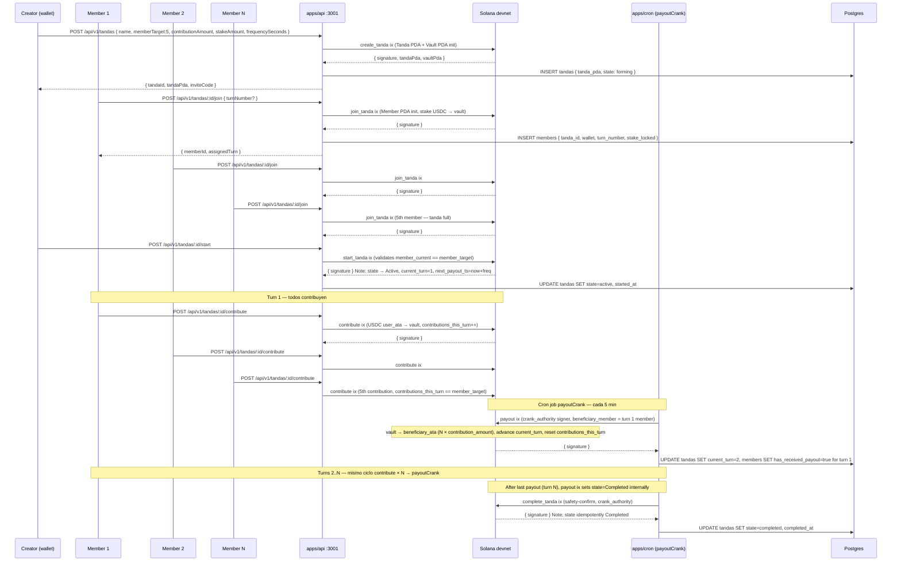

# Comadre — End-to-end flows

> Sequence diagrams Mermaid de los flujos críticos. Para detalles de cada servicio ver `RUNNING.md`. Para detalles del modelo de datos ver `DATA_MODEL.md`.

## TOC

1. [Phone-to-phone USDC transfer (immediate)](#1-p2p-usdc-immediate)
2. [Phone-to-phone USDC transfer (deferred — recipient sin registrar)](#2-p2p-usdc-deferred)
3. [Onboarding (primer mensaje WA → wallet creada)](#3-onboarding)
4. [Tanda lifecycle (create → join → start → contribute → payout × N → complete)](#4-tanda-lifecycle)
5. [Dispute resolution](#5-dispute-resolution)

---

## 1. P2P USDC immediate

### Pre-condiciones

- Sender **y** recipient ambos registrados (`users.phone_hash → wallet`).
- Sender tiene ≥ `amountUsdc` USDC en su ATA devnet.
- Sender tiene Privy embedded Solana wallet activa (credencial en Privy).

### Sequence



### Latencia esperada

| Paso | Tiempo típico |
|---|---|
| Webhook → agent → Kimi (primera llamada) | 2-4 s |
| API buildUnsignedTx | 300-600 ms |
| Kimi segunda llamada (respuesta confirmación) | 1-2 s |
| Privy server-sign | 500-800 ms |
| Solana submitWithRetry | 1-3 s |
| **Total flow completo (2 mensajes)** | **5-12 s** |

### Errores comunes

| Error | Causa | Cómo se manifiesta |
|---|---|---|
| `SELF_TRANSFER` | `recipient.wallet === sender.walletAddress` | "no te podés mandar plata a vos misma, mija" |
| `KYC_LIMIT_EXCEEDED` | `amount > kyc_limits[tier]` | "tu nivel KYC permite hasta $X USDC por tx" |
| `EXPIRED` (409) | Redis TTL expiró (>5 min entre init y confirm) | "Tx blockhash expired; please retry" |
| `PRIVY_SIGN_FAILED` (502) | `walletId` incorrecto o Privy 5xx | status=failed persistido en DB |
| `BROADCAST_FAILED` (502) | RPC caído o SOL insuficiente en fee_payer | status=failed persistido en DB |
| `USER_NOT_FOUND` (404) | Sender no registrado en DB | "Hacé KYC primero" |

---

## 2. P2P USDC deferred

### Pre-condiciones

- Sender **registrado** en Comadre.
- Recipient **NO registrado** (phone_hash no existe en `users`).
- Sender tiene Privy embedded wallet activa.

### Sequence



### Latencia esperada

- Creación deferred: 1-3 s (sin tx on-chain)
- WA best-effort a recipient: 1-2 s adicionales
- Expiración: 7 días

### Errores comunes

| Error | Causa | Cómo se manifiesta |
|---|---|---|
| WA send a recipient falla | `/reply` 5xx (best-effort) | Transfer row igualmente creada; sender puede reintentarlo |
| `EXPIRED` al confirmar posterior | Han pasado >7 días sin onboarding del recipient | status=expired; sender debe reiniciar |
| Recipient onboards pero tx ya expiró | Race condition | El agente informa que hay una tx pendiente expirada; sender retransfer |

---

## 3. Onboarding

### Pre-condiciones

- Phone manda su primer mensaje a Comadre.
- `resolveUserFromTwilio` retorna `null` (no existe en `users`).
- El modelo Kimi decide llamar `iniciar_onboarding` (único tool permitido sin wallet).

### Sequence



### Latencia esperada

| Paso | Tiempo típico |
|---|---|
| Privy importUser | 500-1000 ms |
| init_user_profile on-chain | 1-3 s |
| Total (turno de confirmación) | 3-6 s |

### Errores comunes

| Error | Causa | Cómo se manifiesta |
|---|---|---|
| `UNREGISTERED` tool blocked | Kimi intentó llamar otro tool antes de onboarding | Kimi recibe error interno y re-solicita consentimiento |
| Privy importUser falla | Phone inválido o Privy 5xx | 502; agente responde "no pude crear tu cuenta, intentá de nuevo" |
| `init_user_profile` falla | `phone_hash` vacío o `country_code` inválido | 500; log detallado; onboarding no persistido |
| DB INSERT duplicado | Race condition (dos mensajes casi simultáneos) | `ON CONFLICT DO NOTHING` o unique index en `phone_hash` |

---

## 4. Tanda lifecycle

### Pre-condiciones

- Creator y todos los members ya onboarded (KYC tier ≥ T1Lite para creator).
- Todos tienen USDC devnet suficiente para `stake_amount`.
- Programa Anchor desplegado, `init_config` ejecutado.

### Sequence



### Latencia esperada

| Operación | Tiempo típico |
|---|---|
| create_tanda (2 PDAs init) | 2-4 s |
| join_tanda (stake SPL transfer) | 1-3 s por member |
| start_tanda | 1-2 s |
| contribute (SPL transfer) | 1-2 s |
| payout (crank → SPL transfer N×) | 2-4 s |
| complete_tanda | 1-2 s |

### Errores comunes

| Error | Causa | Cómo se manifiesta |
|---|---|---|
| `InsufficientKyc` en create | Creator tier < T1Lite | 400 del API, Kimi informa al user |
| `TandaFull` en join | `member_current == member_target` | 400; ya no hay cupo |
| `InvalidMemberCount` en start | Falta algún member | 400; "esperá que se unan todos" |
| `NotImplemented` en start | `payout_order_mode != JoinOrder` | MVP solo soporta JoinOrder |
| `AlreadyContributed` en contribute | Member llamó contribute dos veces en el mismo turn | 400 on-chain |
| `MissingContributions` en payout | No todos contribuyeron antes del crank | Cron reintenta hasta cumplido |
| `PayoutNotReady` en payout | `now < next_payout_ts` | Cron respeta la ventana temporal |

---

## 5. Dispute resolution

### Pre-condiciones

- Tanda en estado `Active`.
- Opener es un member activo de la tanda.
- `disputes_opened < MAX_DISPUTES_PER_TANDA`.

### Sequence

```mermaid
sequenceDiagram
  participant OP as Opener (member)
  participant M1 as Member 1
  participant M2 as Member 2
  participant API as apps/api :3001
  participant SOL as Solana devnet
  participant CRN as apps/cron (disputeResolveCrank)
  participant DB as Postgres

  OP->>API: POST /api/v1/tandas/:id/disputes { reason }
  API->>API: hash(reason) → reason_hash [u8;32]
  API->>SOL: open_dispute ix (Dispute PDA init, tanda.state → Paused)
  SOL-->>API: { signature, disputePda }
  API->>DB: INSERT disputes { tanda_id, dispute_pda, state: open, deadline_ts: now+7d }
  API-->>OP: { disputeId, disputePda, deadlineTs }

  Note over OP,SOL: Tanda queda en Paused — contribute y payout rechazados

  M1->>API: POST /api/v1/disputes/:id/vote { continueTanda: true }
  API->>SOL: vote_dispute ix (DisputeVote PDA init — PDA enforces 1 vote/voter)
  SOL-->>API: { signature }

  M2->>API: POST /api/v1/disputes/:id/vote { continueTanda: false }
  API->>SOL: vote_dispute ix

  Note over CRN,SOL: After deadline_ts (7 days) — cron disputeResolveCrank

  CRN->>SOL: resolve_dispute ix (anyone puede llamarlo post-deadline)
  Note over SOL: votes_continue > votes_cancel → tanda.state = Active
  Note over SOL: empate o votes_cancel >= votes_continue → tanda.state = Cancelled
  SOL-->>CRN: { signature }
  CRN->>DB: UPDATE disputes SET state=resolved, UPDATE tandas SET state=active|cancelled
  CRN->>DB: Notify members via scheduled WA reminder job
```

### Latencia esperada

| Paso | Tiempo típico |
|---|---|
| open_dispute (PDA init) | 1-3 s |
| vote_dispute (PDA init) | 1-2 s por voto |
| resolve_dispute (post-deadline) | 1-2 s |
| Ventana de votación | 7 días (DISPUTE_VOTING_WINDOW_SECONDS) |

### Errores comunes

| Error | Causa | Cómo se manifiesta |
|---|---|---|
| `TandaNotActive` al abrir dispute | Tanda ya Paused o Completed | 400; no se pueden abrir disputes en ese estado |
| `MaxDisputesReached` | `disputes_opened >= MAX_DISPUTES_PER_TANDA` | 400 |
| `AccountAlreadyInitialized` en vote | Member intenta votar dos veces | Anchor rechaza — DisputeVote PDA ya existe |
| `DisputeExpired` en vote | `now > deadline_ts` | 400; ventana de votación cerrada |
| `DisputeNotExpired` en resolve | Cron corrió antes del deadline | Instrucción rechazada; cron reintenta |
| Tanda → Cancelled por empate | `votes_cancel >= votes_continue` | Members deben reclamar stakes via `claim_stake` (pendiente de implementar) |

---

## Flujos custodial (post-pivot)

### Onboarding (primer consentimiento)

Disparado cuando un user sin fila en DB manda su primer "sí".

```
WhatsApp "sí"
     │
     ▼
comadre-whatsapp
  valida firma Twilio
     │
     ▼
comadre-agent
  toolsForWalletState(null)  ← wallet no en DB
  → iniciar_onboarding en toolset
  LLM llama tool: iniciar_onboarding
     │
     ▼
comadre-api  POST /api/v1/onboarding/init
  1. Keypair.generate()
  2. INSERT user_keypairs (wallet, secret_key_b58)
  3. INSERT users (wallet, phone_hash, kyc_tier=t0_demo)
  4. airdrop 0.05 SOL  fee_payer → user wallet
  5. Anchor: init_user_profile  payer=fee_payer
  6. Anchor: update_kyc_tier(t1Lite)  signer=kyc_oracle
  7. UPDATE users SET kyc_tier='t1_lite'
     │
     ▼
  return { walletAddress, kyc_tier: 't1_lite' }
     │
     ▼
LLM responde con bienvenida al user
```

Después del onboarding, `toolsForWalletState(wallet)` excluye `iniciar_onboarding` en todos los turnos siguientes.

### Crear tanda

```
WhatsApp "creá una tanda Demo de 3 personas, 10 USDC por semana"
     │
     ▼
comadre-agent  LLM llama tool: crear_tanda({ name, member_target, contribution_amount_cents, frequency_days, payout_order_mode })
     │
     ▼
comadre-api  POST /api/v1/tandas
  1. buildCreateTandaIx
       creator   = user.wallet (PubKey)
       name_hash = SHA-256(name)
       amount    = new BN(amount_atomic_usdc)
  2. construye Anchor create_tanda ix
  3. fee_payer pre-firma (paga rent + fees)
  4. signWithUserKeypair(creator) ← backend firma como user
  5. submitWithRetry(tx)
  6. INSERT tandas (id=tanda_pda, creator_wallet, ...)
     │
     ▼
  return { tanda_id, signature, explorer_url }
     │
     ▼
crearTandaExecute → { type: "data", data: { ... } }
     │
     ▼
LLM (regla "REGLAS CUANDO UNA TOOL DEVUELVE DATOS REALES"):
  - relayea explorer_url al user
  - presenta tanda_id[0..7] como código corto de invitación
```

### Unirse a tanda

```
WhatsApp "quiero unirme a la tanda 8jK8UsMv..."
     │
     ▼
comadre-agent  LLM llama tool: unirse_tanda({ tanda_id })
     │
     ▼
comadre-api  POST /api/v1/tandas/:id/join
  1. buildJoinTandaIx
     a. createAssociatedTokenAccountInstruction
          para el ATA USDC del user (si no existe)
     b. Anchor join_tanda ix
          signer = user.wallet
  2. fee_payer pre-firma
  3. signWithUserKeypair(user.wallet)
  4. submitWithRetry(tx)
  5. INSERT members + UPDATE tandas.member_current
     │
     ▼
  return { tanda_id, member, signature, explorer_url }
     │
     ▼
LLM relayea confirmación + explorer_url
```

### Guardadito — APR + nudge gate

**APR injection** (`apps/agent/src/lib/savingsContext.ts`): en cada turno del agent donde existe wallet, se inyecta al system prompt:

```
Tasa anual actual del chanchito: X.XX% (variable, no garantizado)
```

`X.XX` viene de `GET /api/v1/savings/summary` → `mockAdapter.ts`, que devuelve un APY mock determinístico que varía día a día entre 4.5% y 6.5%. La regla del system prompt "PORCENTAJE / GANANCIA — REGLA FUNDAMENTAL" obliga al LLM a usar este número exacto cuando el user pregunta cuánto rinde.

**Nudge gate** (`apps/agent/src/lib/nudgeGate.ts`): sugerencias proactivas de Guardadito disparan solo cuando:

- **Trigger**: el user manda un saludo (`hola`, `buenas`) **O** los últimos 6 mensajes contienen un tool result con `tanda_id` + `signature` (post-tanda).
- **Guard**: no hay fila en `savings_nudges` para este user en las últimas 24h.
- Después de entregar la sugerencia, se inserta una fila en `savings_nudges` para arrancar el cooldown de 24h.
