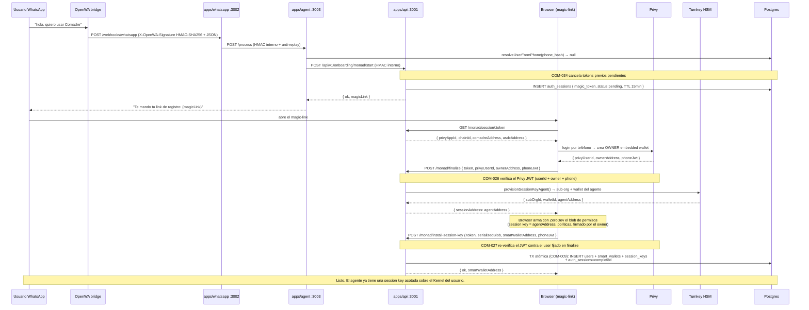
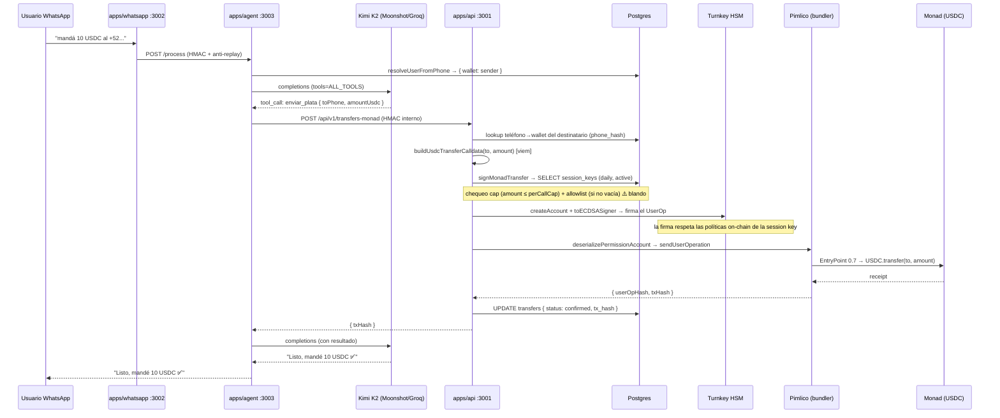
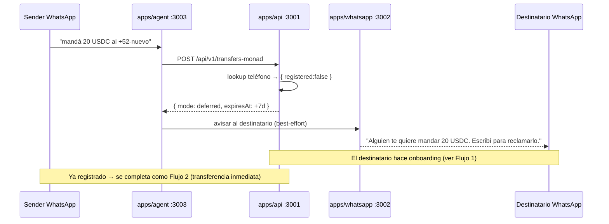
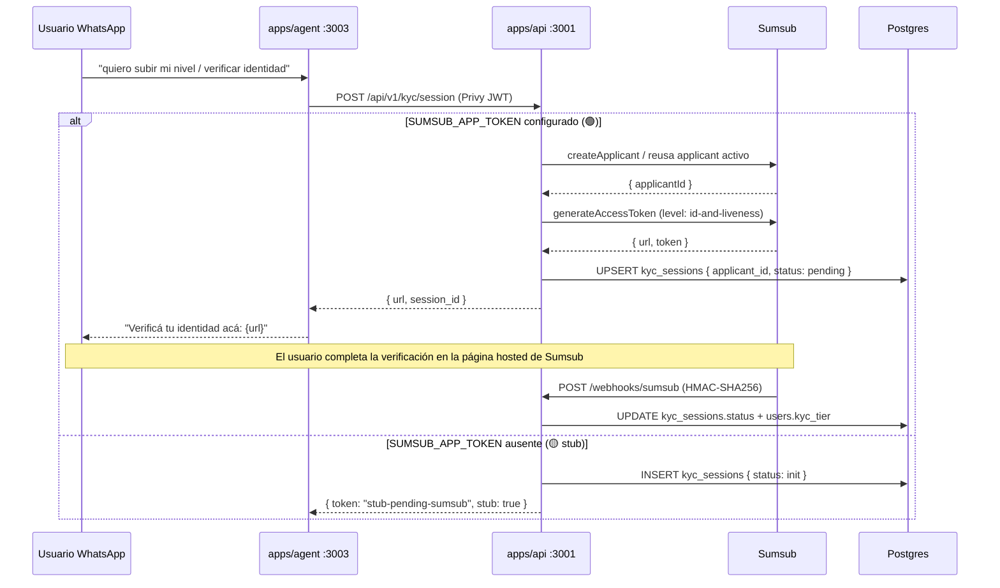
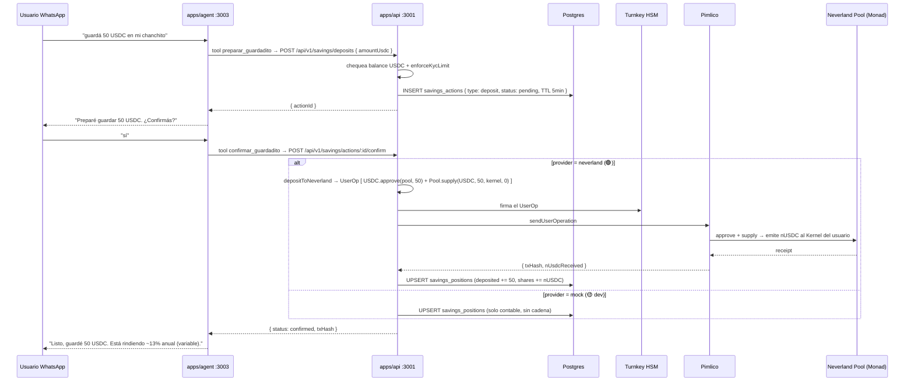
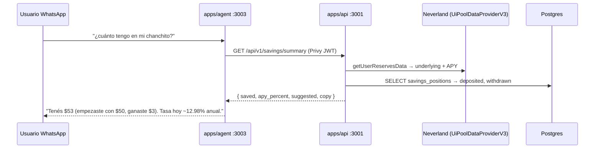

# Comadre — End-to-end flows

> Diagramas de secuencia (Mermaid) de los flujos críticos. Para la visión, el alcance del MVP y la topología/arquitectura ver `COMADRE.md` (documento canónico).
>
> **Actualizado: 2026-06-11 — canal migrado de Twilio a OpenWA.** Stack real: **WhatsApp (OpenWA) → agente LLM (Kimi K2) → API (Hono/Bun) → wallet-infra → Turnkey (firma HSM) → Pimlico (bundler ERC-4337) → Monad**. Las wallets de usuario son **smart accounts ZeroDev Kernel v3.1**; el _owner_ se crea con **Privy**; el agente opera con una **session key** acotada.
>
> Reescrito desde cero: los diagramas previos describían el stack legacy **Solana / SPL / Privy-sign / Anchor**, ya retirado. Si encontrás `VersionedTransaction`, `signWithUserKeypair`, `airdrop SOL` o `init_user_profile` en algún diagrama, es legacy — reportalo.

## Leyenda de estado

| Símbolo | Significado |
|---|---|
| 🟢 | **LIVE** — cableado punta a punta hoy |
| 🟡 | **Parcial** — funciona con salvedades (stub/mock, o no verificado end-to-end) |
| 🔴 | **FASE 2** — diseñado pero NO cableado (contrato/cranks son stubs) |

## Modelo de dos wallets (la clave para entender todo)

Cada usuario tiene DOS llaves sobre una misma cuenta. Esto es el corazón del modelo de seguridad:

```
┌──────────────────────────────────────────────────────────────┐
│  Smart Account del usuario  (ZeroDev Kernel v3.1, en Monad)    │
│                                                                │
│   OWNER  ──────  Privy embedded wallet (la persona)            │
│                  control total: retira, cambia límites, revoca │
│                                                                │
│   SESSION KEY ─  el AGENTE (firmada por Turnkey HSM)           │
│                  acotada: cap $50/tx · selectores USDC+Comadre │
│                  · rate-limit 10/60s · expira a 30 días        │
└──────────────────────────────────────────────────────────────┘
```

El agente **nunca** tiene control total: solo una session key con permisos limitados que el _owner_ instaló durante el onboarding. (Detalle de límites y hallazgos de seguridad sobre esos permisos: ver `SECURITY.md` / auditoría.)

## Frontera off-chain / on-chain

```
OFF-CHAIN  (orquestación — confiás en tu backend)   │  ON-CHAIN  (Monad — trustless)
 WhatsApp · agente · apps/api · Postgres · Redis     │  Kernel account · USDC · Neverland · Comadre.sol
 decide, arma calldata, cachea estado                │  Turnkey firma → Pimlico bundlea → EntryPoint 0.7 ejecuta
```

Las tablas `users / tandas / members / disputes` son **espejos** de estado on-chain (la cadena manda; la DB es lectura rápida). El resto (`transfers`, `savings_*`, `conversations`, `auth_sessions`…) es estado puramente off-chain.

## TOC

1. [Onboarding (magic-link → owner Privy + agente Turnkey + Kernel)](#1-onboarding) — 🟢
2. [Transferencia P2P de USDC — inmediata](#2-p2p-inmediata) — 🟢
3. [Transferencia P2P — diferida (destinatario sin wallet)](#3-p2p-diferida) — 🟡
4. [KYC (Sumsub)](#4-kyc) — 🟢 / 🟡
5. [Guardadito — depositar (Neverland)](#5-guardadito-depositar) — 🟢
6. [Guardadito — retirar con fee sobre el yield](#6-guardadito-retirar) — 🟢
7. [Guardadito — consultar + nudge proactivo](#7-guardadito-consultar) — 🟢
8. [Tanda lifecycle](#8-tanda-lifecycle) — 🔴 FASE 2
9. [Resolución de disputas](#9-disputas) — 🔴 FASE 2

---

## 1. Onboarding 🟢 {#1-onboarding}

> El flujo arranca por WhatsApp pero **se completa en el browser**: el agente devuelve un magic-link en la respuesta (fallback de SMS; Twilio ya no se usa para esta entrega). Privy crea el _owner_ del usuario; la API provisiona el _agente_ en Turnkey; el browser instala la session key sobre el Kernel.

### Pre-condiciones

- El teléfono no existe en `users` (`resolveUserFromPhone` → `null`).
- Único tool permitido sin wallet: `iniciar_cuenta_segura` (el teléfono se inyecta server-side, no lo controla el LLM).

### Secuencia



### Notas

- **Dos wallets quedan registradas**: `smart_wallets.owner_address` (Privy) y `smart_wallets.agent_wallet_address` (Turnkey). La session key (`session_keys`) referencia `turnkey_sub_org_id` + `turnkey_wallet_id` + `serialized_permission`.
- El blob de permisos se construye **en el browser** con el SDK de ZeroDev y lo firma el owner — el backend nunca tiene la llave del owner.
- ⚠️ `sessionAgentMemory` guarda el agente provisionado en un `Map` en memoria (TTL 5min) entre `finalize` e `install`. Esto **rompe en multi-réplica** (bloqueante de escalado conocido — mover a Redis está diferido).
- `permissionId` se persiste vacío (`TODO COM-033`) → la revocación on-chain (`uninstallValidator`) no está disponible; solo revocación soft (borrar la fila).

### Errores comunes

| Error (HTTP) | Causa |
|---|---|
| `validation` (400) | phone no E.164 / payload inválido |
| `unauthorized` (401) | Privy JWT inválido o `userId`/`owner`/`phone` no coinciden (COM-026/027) |
| `expired` (410) | magic-token vencido (>15min) |
| `finalize_required` (409) | se llamó `install` sin `finalize` previo |
| `session_expired` (410) | el agente en memoria expiró (>5min entre finalize e install) |
| `install_failed` (500) | la transacción de DB falló (rollback completo) |

---

## 2. Transferencia P2P de USDC — inmediata 🟢 {#2-p2p-inmediata}

> Ambos registrados. El monto se topea **on-chain** (CallPolicy de ZeroDev ≤ $50/tx); el allowlist de destinatario se chequea en el backend (ver salvedad de seguridad).

### Secuencia



### Notas de seguridad (importante)

- **Monto**: topeado on-chain por la `CallPolicy` (≤ `perCallCapMicroUsdc`, hoy $50). Un agente comprometido NO puede exceder esto.
- **Destinatario**: el allowlist se valida **solo en el backend** (`monadSessionSigner.ts`) y **solo si la lista no está vacía** — y arranca vacía en el onboarding (`TODO COM-004`). On-chain el `to` del `transfer` NO está restringido. Un path que firme directo (`signAndSendUserOp`) saltea el chequeo. → ver `SECURITY.md`.
- **No hay tope diario acumulado**: solo cap por-tx + rate-limit 10/60s + expiración 30d.

### Errores comunes

| Error | Causa |
|---|---|
| `USER_NOT_FOUND` (404) | sender no registrado |
| `wallet_not_found` / `no_session` | sin smart wallet o sin session key activa |
| `cap_exceeded` | monto > cap por-tx |
| `recipient_not_allowed` | destinatario fuera del allowlist (cuando la lista existe) |
| `KYC_LIMIT_EXCEEDED` | monto > límite del tier KYC |

---

## 3. Transferencia P2P — diferida (destinatario sin wallet) 🟡 {#3-p2p-diferida}

> Estado 🟡: el modelo de datos lo soporta (`transfers.status = awaiting_recipient`, expiración ~7d) pero conviene verificar el path completo en `transfersMonad.ts` antes de tratarlo como LIVE.

### Flujo (nivel producto)



### Decisión de diseño pendiente

Hay dos formas de resolver "mandar a alguien sin wallet", y la elección define si hace falta un contrato:
- **Wallet just-in-time** (Privy/Turnkey genera la wallet del destinatario) → cero Solidity. Recomendado para MVP.
- **Escrow on-chain por `phoneHash`** → requiere un `.sol` nuevo. Solo si se quiere que el reclamo sea trustless.

---

## 4. KYC (Sumsub) 🟢 / 🟡 {#4-kyc}

### Secuencia



### Notas

- El tier KYC gobierna límites de monto (`enforceKycLimit`) y la capacidad de crear tandas (≥ T1Lite) en FASE 2.
- En on-chain, el tier se refleja vía `Comadre.updateKycTier` (oráculo) — hoy ese write depende del contrato (FASE 2); el espejo en DB (`users.kyc_tier`) es la fuente operativa.

---

## 5. Guardadito — depositar (Neverland) 🟢 {#5-guardadito-depositar}

> "Guardadito" es el nombre de cara al usuario; internamente es un _strategy adapter_: `mock` (default, solo DB) o `neverland` (real, on-chain). Flujo de dos pasos: **preparar → confirmar**.

### Secuencia



### Errores comunes

| Error | Causa |
|---|---|
| `INSUFFICIENT_BALANCE` (400) | USDC disponible < monto |
| `KYC_LIMIT_EXCEEDED` (400) | supera el límite del tier |
| `CONFIG_MISSING` (503) | config de Neverland incompleta |
| `TX_FAILED` (502) | el UserOp revirtió — "tu dinero no fue movido" |
| `EXPIRED` (409) | la acción venció (>5min entre preparar y confirmar) |

---

## 6. Guardadito — retirar con fee sobre el yield 🟢 {#6-guardadito-retirar}

> El fee (20%) se cobra **solo sobre la ganancia**, nunca sobre el principal. `withdraw` + `transfer(fee)` van en **un UserOp atómico**.

### Secuencia

```mermaid
sequenceDiagram
  participant U as Usuario WhatsApp
  participant A as apps/agent :3003
  participant API as apps/api :3001
  participant DB as Postgres
  participant TK as Turnkey HSM
  participant PIM as Pimlico
  participant NV as Neverland Pool (Monad)
  participant FW as Comadre fee wallet

  U->>A: "retirá todo mi chanchito"
  A->>API: tool consultar_guardadito → GET /api/v1/savings/summary
  API->>NV: getUserReservesData → underlying actual
  API->>DB: getPrincipalsFromDb → { deposited, principalWithdrawn }
  API->>API: yield = underlying − (deposited − withdrawn); fee = yield × 20%
  API-->>A: { underlying, fee, userReceives }
  A-->>U: "Tenés $53 (ganaste $3). Fee $0.60. ¿Retirás $52.40?"

  U->>A: "sí"
  A->>API: tool confirmar_guardadito (retiro) → POST /savings/actions/:id/confirm
  API->>API: withdrawFromNeverland → UserOp [ Pool.withdraw(USDC, 53, kernel) + USDC.transfer(feeWallet, 0.60) ]
  API->>TK: firma
  API->>PIM: sendUserOperation
  PIM->>NV: withdraw (quema nUSDC → USDC al Kernel)
  PIM->>FW: USDC.transfer del fee
  PIM-->>API: { txHash, userReceived, comadreFee }
  API->>DB: UPDATE savings_positions (principal_withdrawn, status)
  API-->>A: { status: confirmed, txHash }
  A-->>U: "Retiré $52.40 a tu billetera. Fee $0.60 (20% de lo ganado)."
```

> ⚠️ **Seguridad (ver `SECURITY.md`)**: en las políticas de la session key, `Pool.withdraw` tiene monto **y** destinatario sin restringir on-chain. Si el yield está activo, un agente comprometido puede retirar toda la posición a una dirección arbitraria, salteando el cap de $50. Pendiente de constrain.

---

## 7. Guardadito — consultar + nudge proactivo 🟢 {#7-guardadito-consultar}



- **APR injection** (`apps/agent/.../savingsContext.ts`): en cada turno con wallet se inyecta el APY real de `GET /savings/summary` al system prompt. El LLM debe usar ese número exacto.
- **Nudge gate** (`nudgeGate.ts`): sugerencias proactivas solo si el user saluda **o** acaba de cerrar una tanda, y no hubo nudge en las últimas 24h (`savings_nudges`).

---

## 8. Tanda lifecycle 🔴 FASE 2 {#8-tanda-lifecycle}

> **NO cableado hoy.** Las rutas de tanda devuelven calldata stub (`lib/stubs.ts → makeTxStub`), `apps/cron` corre los cranks como stubs, y `Comadre.sol` (Foundry) todavía no está deployado ni integrado. La session key **ya** whitelistea los selectores `contribute / joinTanda / openDispute / voteDispute / claimStake` (ver `wallet-infra/.../policies.ts`), así que el día que el contrato esté en Monad, el agente podrá invocarlos dentro de sus límites.

### Flujo previsto (cuando esté deployado)

```mermaid
sequenceDiagram
  participant CR as Creator / Members
  participant API as apps/api :3001
  participant TK as Turnkey + Pimlico
  participant CO as Comadre.sol (Monad)
  participant CRN as apps/cron (crank)
  participant DB as Postgres

  CR->>API: crear_tanda / unirse_tanda / aportar_turno
  API->>TK: UserOp (session key) → Comadre.createTanda / joinTanda / contribute
  TK->>CO: ejecuta (stake/contribución → vault del contrato)
  CO-->>TK: receipt
  API->>DB: actualiza espejos (tandas, members)
  Note over CRN,CO: payout y slash los llama crank_authority (NO la session key)
  CRN->>CO: payout(turno) cuando se cumplió la ventana + todos aportaron
  CO-->>CRN: transferencia al beneficiario; avanza turno o Completed
```

> ⚠️ **Bloqueante conocido antes de plata real (CRIT-01)**: en `Comadre.sol`, `payout` exige `contributionsThisTurn == memberTarget`, pero al slashear a un moroso se baja `memberCurrent` y **no** `memberTarget`. Tras el primer slash, `payout` revierte para siempre → la tanda queda trabada y los fondos encerrados. Hay que arreglarlo antes de deployar. Ver auditoría de `Comadre.sol`.

---

## 9. Resolución de disputas 🔴 FASE 2 {#9-disputas}

> **NO cableado hoy** (mismo estado que las tandas: rutas y `disputeResolveCrank` son stubs; contrato sin deployar).

### Flujo previsto

```mermaid
sequenceDiagram
  participant OP as Opener (member)
  participant MEM as Members
  participant API as apps/api :3001
  participant CO as Comadre.sol (Monad)
  participant CRN as apps/cron (disputeResolveCrank)

  OP->>API: abrir_disputa → openDispute(tanda, reasonHash)
  API->>CO: UserOp (session key) → tanda pasa a Paused
  MEM->>API: votar_disputa → voteDispute(continue|cancel)
  API->>CO: UserOp por voto (1 voto por member; opener no vota)
  Note over CRN,CO: tras la ventana de 7 días (DISPUTE_VOTING_WINDOW)
  CRN->>CO: resolveDispute (cualquiera post-deadline)
  CO-->>CRN: quórum = ceil(memberTarget/2); gana mayoría; empate → Cancelled
  Note over CO: Active (continúa) · Cancelled (members reclaman stake con claimStake)
```

---

## Referencias de código

| Flujo | Archivos clave |
|---|---|
| Onboarding | `apps/api/src/routes/onboarding.ts`, `packages/wallet-infra/src/sessionKey/` |
| Transferencia | `apps/api/src/routes/transfersMonad.ts`, `apps/api/src/lib/monadSessionSigner.ts`, `monadUsdcTransfer.ts`, `wallet-infra/.../sign.ts` |
| Políticas session key | `packages/wallet-infra/src/sessionKey/policies.ts` |
| KYC | `apps/api/src/routes/kyc.ts`, `lib/sumsubClient.ts`, webhook `routes/webhooks.ts` |
| Guardadito | `apps/api/src/routes/savings.ts`, `lib/savings/neverlandSavingsAdapter.ts` |
| Tandas / disputas (FASE 2) | `packages/monad-contracts/src/Comadre.sol`, `apps/cron/`, `apps/api/src/lib/stubs.ts` |
